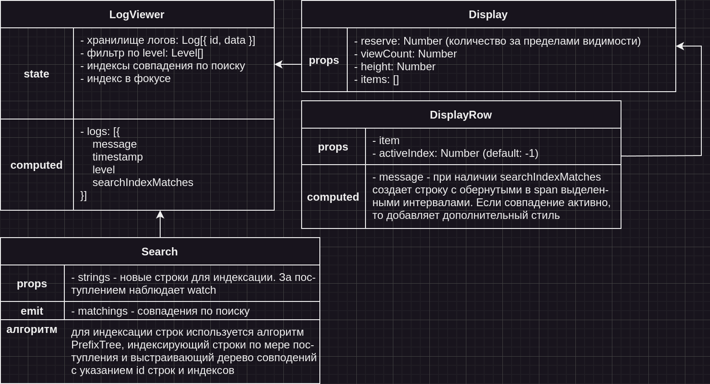

# Log Viewer

### Compiles and hot-reloads for development
```
npm run serve
```

## ApiService

### Сделано:
- переподключение при разрыве соединения;
- очередь сообщений;
- пинг на уровне WebSocket (видел, что на беке это порождает ошибки, нужно перенести на уровень WAMP или правильно настроить);
- постарался учесть утечки памяти;
- разделение на слои: WebSocketClient (уровень сокета), WampService (уровень WAMP), ApiService (уровень бизнеса).

### Не сделано:
- пинг на уровне WAMP
- неотловленные баги, не обработанные ситуации


## UI-компоненты



### LogViewer
Основной компонент, в котором происходит получение логов, запис их в хранилище, фильтрация, получение индексов совпадения. Для приведения данных о логах в нужный вид используется computed свойство.

### Search

#### Реализация поиска в массиве строк
Поиск происходит при помощи класса Trie, который реализует алгоритм PrefixTree и имеет следующий интерфейс:
- index(tokenId: string | number, token: string): void
- search(string: string): void
- matchings: { tokenId: [[startIndex, endIndex]] }
Внимание: на данный момент в репозитории находится класс, который неправильно реализует алгоритм. Его необходимо завершить.

##### Алгоритм индексации:
- получаем токен
- проходим циклом по токену
- проверяем на каждом символе в корне внутреннего хранилища вхождение символа
- если вхождения нет, создаем ключ, коответствующий символу, и значение, равное объекту с ключом, хранящим id токена и индекс текущего символа в строке
- если вхождение есть, то переходим в него и добавляем в ключ, хранящий id токена и индекс текужего символа в строке, значения символа
- проверяем, есть ли в корне внутреннего хранилища вхождение текущего символа. Если нет, то копируем созданный объект в корень хранилища под соответствующим символу ключом
- проходим всю строку

##### Алгоритм поиска
1. получаем токен
2. проходим циклом по токену
3. на первом шаге проверяем есть ли совпадение символа с ключами в корне
4. если нет, то завершаем поиск
5. если есть, то переходим по ключу, сохранив значение из ключа, содержащего id токенов и индексы
6. проверяем есть ли совпадение символа с ключами в текущем объекте
7. если нет, то завершаем поиск
8. если есть, то переходим по ключу пока не закончится строка
9. при завершении строки сверяем значения из ключа, хранящего id токенов и индекс символов с уже сохраненным значением из 5 шага
10. сохраняем все id токенов в специальном ключе matchings с указанием индексов совпадения

#### Props
- strings - массив строк для индексации

#### Emits
- matchings - результаты поиска


### Display
Не хватило времени продумать компонент. Что нужно широкими мазками:
- должен быть механизм виртуального скрола, отображающий небольшое количество элементов списка
- небольшое количество элементов так же не исчезают для более плавной работы при скроле (к примеру сверху-снизу по 50 элементов. Можно регулировать пропсом)
- пропсом задается высота одного элемента списка
- передается список элементов

### DisplayRow
- рендерит строку, коответствующую одной записи
- имеет пропс для приема данных о элементе. Данные содержат всю необходимую информацию для отображения, ключая индексы совпадения в поиске
- имеется пропс, указывающий номер индекса автивного совпадения
- отображение данных из поля message происходит при помощи пропса, оборачивающего совпадения в span с необходимыми стилями
